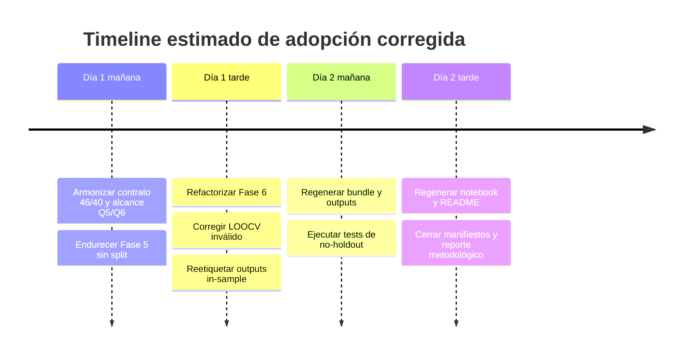

# Evaluación analítica de la propuesta de cambio metodológico para Research_AI_law

## Resumen ejecutivo

La recomendación contenida en `new_met.md` es, en lo sustantivo, **adecuada y metodológicamente defendible**, porque coincide con el núcleo de la corrección ya introducida en el plan maestro `5.PLAN_FASE_MVP_END_TO_END.md` y luego operacionalizada en los blueprints `6.PLAN_FASE5_V2.1_UPDATE.md` y `8.FASE6_V2.1_UPDATE.md`: abandonar el `train/test split` heredado, usar la muestra preregistrada completa de 43 países por *outcome*, reemplazar el falso *holdout* por validación interna y sensibilidad, y reportar resultados como **asociaciones ajustadas** en lugar de “predicciones independientes”. fileciteturn0file0 fileciteturn0file1 fileciteturn0file2 fileciteturn0file3

La literatura técnica y académica respalda ese giro. Las guías TRIPOD advierten que dividir aleatoriamente un único dataset suele confundirse con validación externa cuando en realidad es una forma **débil e ineficiente** de validación interna; simulaciones clásicas de Steyerberg y Harrell muestran que el *split-sample* tiene alta variabilidad y que el *bootstrap* suele estimar mejor la validez interna; y Arlot & Celisse presentan la validación cruzada como una estrategia estándar para estimación de riesgo y selección de modelos. En paralelo, Hernán y Robins recuerdan que en datos observacionales la asociación no debe venderse como causalidad sin un diseño causal explícito. citeturn5search0turn0search2turn0search3turn0search4turn0search6turn1search48turn1search1

Mi recomendación final no es “rechazar”, pero tampoco “aceptar sin tocar”. La propuesta debe **aceptarse con modificaciones**. La razón es que `new_met.md` resume bien el cambio de paradigma, pero deja fuera varios resguardos que sí aparecen en los documentos operativos: la preservación del alcance Q5/Q6 y del contrato de 46 variables observadas, la corrección explícita del uso inválido de LOOCV con AUC y \(R^2\), la exigencia de que el remuestreo replique todas las etapas del modelado, y la política de lenguaje y semántica de outputs para que los archivos por país no se lean como predicciones independientes. fileciteturn0file1 fileciteturn0file2 citeturn5search0turn2search0turn2search1turn7search1turn3search0

En cronograma y costos, la evidencia documental es desigual. El plan maestro sí fija un cronograma global de **14–18 horas** para el MVP F5–F8, pero los blueprints correctivos de Fase 5 y Fase 6 **no especifican** costo monetario ni duración incremental del cambio. Por inferencia, el impacto marginal parece más cercano a una refactorización controlada de contratos, tests, notebooks y metadatos que a un rediseño total del pipeline, pero el dato exacto no está explicitado. fileciteturn0file0 fileciteturn0file1 fileciteturn0file2

## Recomendación exacta de new_met.md

A continuación, transcribo la recomendación **exacta** contenida en `new_met.md`: fileciteturn0file3

> La reestructuración de la arquitectura del proyecto `5.PLAN_FASE_MVP_END_TO_END.md` debe centrarse en un cambio de paradigma fundamental: **abandonar la lógica predictiva de "caja negra" (train/test split) y formalizar el pipeline como un estudio inferencial-comparativo observacional**.
>
> Dado que tu muestra es pequeña ($N=43$) y el objetivo es informar la política pública chilena sobre asociaciones estadísticas, esta es la reestructuración recomendada para cada fase del pipeline:
>
> ### 1. Reestructuración de Fase 5: De Partición a Membresía
> La arquitectura ya no debe "amputar" el 20% de tus datos (9 países) para un test set que sería estadísticamente inestable y geopolíticamente sesgado.
> *   **Eliminación de artefactos predictivos:** Debes eliminar la creación de `phase6_train_test_split.csv` y cualquier columna llamada `split` en la matriz de características.
> *   **Nueva tabla de membresía (`analysis_sample_membership.csv`):** Este archivo se convierte en el contrato central. Debe documentar explícitamente la pertenencia de los 43 países y definir **flags de sensibilidad** (región, nivel de ingresos, líderes en IA como EE. UU. o China).
> *   **Contrato Inferencial:** El archivo `phase6_modeling_contract.yaml` debe declarar explícitamente `use_holdout_test_set: false` y definir el alcance como `full_preregistered_sample`.
>
> ### 2. Reestructuración de Fase 6: Estimación de Asociaciones Ajustadas
> En lugar de buscar maximizar métricas *out-of-sample* (como AUC o $R^2$ en un test set pequeño), el modelado debe centrarse en la **precisión de los coeficientes y la medición de la incertidumbre**.
> *   **Uso de la muestra completa:** Cada módulo (Inversión, Adopción, Innovación) debe usar todos los países disponibles para ese resultado específico (outcome), aplicando `dropna()` solo sobre las columnas necesarias y reportando siempre el **$n_{effective}$**.
> *   **Validación interna vía Bootstrap:** La arquitectura debe incorporar el remuestreo (bootstrap) como la herramienta principal para generar **intervalos de confianza (IC95)** para los coeficientes regulatorios.
> *   **Cambio Semántico en los Resultados:** Los archivos de salida, como `*_predictions_per_country.csv`, deben renombrarse o etiquetarse internamente como **"scores descriptivos in-sample"** o **"posicionamiento relativo"**, reconociendo honestamente que esos países ayudaron a definir los parámetros del modelo.
>
> ### 3. Reestructuración de Fase 7: De Validación a Análisis de Sensibilidad
> Esta fase deja de ser un "trámite" de métricas de error y se convierte en el **guardián de la robustez científica** del estudio.
> *   **Pruebas de Estrés (Sensitivity Analysis):** La arquitectura debe ejecutar análisis de tipo *Leave-Group-Out*. Esto implica reportar qué sucede con la asociación entre regulación y ecosistema si excluyes a los líderes (USA/China) o si dejas fuera a una región completa (ej. LATAM).
> *   **Comparación con Baselines Triviales:** Debes demostrar que tus variables regulatorias aportan más información que un modelo simple basado solo en controles socioeconómicos como el PIB.
>
> ### 4. Gobernanza Técnica y API
> Para asegurar que este cambio metodológico sea auditable, la estructura de directorios y el flujo de datos deben ser rígidos:
> *   **Inmutabilidad de Fases Previas:** El MVP solo debe "leer" de las Fases 3 y 4 a través de APIs internas (`src.fase3.api`), garantizando que la preparación de datos no contamine la base de datos original.
> *   **Centralización de Decisiones:** Todas las correcciones metodológicas deben quedar firmadas en un archivo `mvp_decisions.yaml` que sirva como bitácora de auditoría para stakeholders políticos.
>
> ### Resumen del Flujo de Valor
> Con esta arquitectura reestructurada, el entregable final en **Fase 8** ya no dirá "predigo que Chile tendrá X inversión", sino: **"Se observa una asociación ajustada de magnitud Y entre el tipo de regulación y la innovación, que se mantiene estable incluso al excluir outliers, lo que fundamenta la recomendación de un enfoque regulatorio específico para el Boletín 16821-19"**.
>
> Este enfoque protege tu credibilidad ante el Senado o Ministerios al no vender una capacidad predictiva que una muestra de $N=43$ no puede sostener técnicamente. fileciteturn0file3

En términos analíticos, el texto propone cuatro ejes: eliminar el *split*, convertir la Fase 5 en un contrato de membresía, recentrar Fase 6 en coeficientes/incertidumbre, transformar Fase 7 en robustez y reforzar la gobernanza. Eso está bien alineado con los documentos base. El problema no es de dirección; es de **completitud operativa**. fileciteturn0file0 fileciteturn0file1 fileciteturn0file2 fileciteturn0file3

## Síntesis de los archivos base

Los tres archivos locales no describen tres metodologías distintas, sino tres niveles del mismo diseño: un plan maestro F5–F8, un blueprint correctivo para Fase 5 y otro para Fase 6. Por eso, la pregunta de adecuación no es si `new_met.md` “choca” con ellos, sino si los resume fielmente y sin perder condiciones críticas. fileciteturn0file0 fileciteturn0file1 fileciteturn0file2

### Plan maestro F5–F8

| Dimensión | Síntesis |
|---|---|
| Objetivos | Implementar un MVP end-to-end metodológicamente correcto para responder una hipótesis inferencial sobre asociación entre regulación de IA y desarrollo del ecosistema de IA en 43 países. |
| Alcance | Cubre Fases 5 a 8 de CRISP-DM; usa exclusivamente activos auditables de Fase 3 y Fase 4; deja fuera NLP, análisis temporal, deployment y causalidad fuerte. |
| Metodología actual | Ya corregida a **inferencial/comparativa observacional**; sin `test set` independiente; estimación primaria con todos los países disponibles por *outcome*; validación interna con *bootstrap*, CV y sensibilidad. |
| Entregables | Notebook maestro de Fase 8, Excel auditable, informe ejecutivo y 4 notebooks de verificación. |
| Cronograma | Sí especificado: **14–18 horas** para todo el MVP F5–F8. |
| Riesgos | Sí especificados: nombres de variables, debilidad estadística con N=43, reinstalación accidental del *split*, sobreajuste RF, PSM con pocos *matches*, inestabilidad al excluir USA, problemas de clustering y ejecución lenta. |
| Supuestos | Inmutabilidad de Fase 3/4, API-only, cero imputación, submuestra fija de 43 entidades, variables preregistradas, preservación de *outliers*, lenguaje no causal y ausencia de *holdout* ficticio. |

Todos los elementos de esta síntesis provienen del plan maestro. fileciteturn0file0

El plan maestro, además, ya formula el problema exacto que `new_met.md` intenta corregir: la contradicción entre crear un `train/test split` en Fase 5 y entrenar después con todos los países disponibles en Fase 6. También deja una regla fuerte: ningún archivo debe llamar “test set independiente” a países que participaron en curaduría, transformación o modelado. fileciteturn0file0

Hay, sin embargo, una inconsistencia interna importante: el documento anuncia “46 variables core (40 v1.0 + 6 v2.0)”, pero la sección exhaustiva de curaduría cierra con “TOTAL = 40 variables core”. Esa ambigüedad no invalida la corrección metodológica, pero sí muestra que la armonización de alcance y nomenclatura sigue siendo una tarea pendiente. fileciteturn0file0

### Blueprint Fase 5 v2.1

| Dimensión | Síntesis |
|---|---|
| Objetivos | Corregir Fase 5 para que entregue a Fase 6 un bundle coherente con un estudio inferencial/comparativo. |
| Alcance | Elimina los artefactos `train/test`; crea `analysis_sample_membership.csv`; mantiene la submuestra de 43 países y las 46 variables observadas; no reabre curaduría, no cambia Fase 3/4. |
| Metodología actual | Muestra completa, contrato inferencial explícito, ausencia de columna `split`, validación posterior vía *bootstrap*, CV interna y Fase 7. |
| Entregables | `feature_matrix_mvp.csv`, `coverage_report_mvp.csv`, `analysis_sample_membership.csv`, `MVP_AUDITABLE.xlsx`, `fase5_manifest.json` y un bundle `phase6_ready` sin archivos de *split*. |
| Cronograma | **No especificado** como duración incremental de la corrección. |
| Riesgos | No hay una sección formal de riesgos propia; el foco es correctivo y contractual. |
| Supuestos | Fase 5 v2.0 existe, Fase 3/4 no se tocan, 43 países y 46 variables están presentes, y Fase 6 debe consumir el nuevo contrato sin reintroducir `split`. |

Todos los elementos de esta síntesis provienen del blueprint de Fase 5 v2.1. fileciteturn0file1

Este archivo es especialmente relevante para evaluar `new_met.md` porque convierte sus intuiciones en artefactos concretos: reemplaza `load_train_test_split()` por `load_analysis_sample_membership()`, prohíbe `phase6_train_test_split.csv`, fuerza `use_holdout_test_set: false` en `phase6_modeling_contract.yaml` y redefine el lenguaje permitido y prohibido. En otras palabras, **ya implementa** lo que `new_met.md` recomienda en forma resumida. fileciteturn0file1

### Blueprint Fase 6 v2.1

| Dimensión | Síntesis |
|---|---|
| Objetivos | Actualizar Fase 6 para consumir correctamente el bundle inferencial de Fase 5 v2.1 y eliminar toda deuda ligada al *split*. |
| Alcance | Reescribe contrato, tests, notebook, README, semántica de outputs y metadatos de modelado; no agrega nuevos modelos ni cambia Fase 3/4 o outputs de Fase 5. |
| Metodología actual | Usa todos los países disponibles por *outcome*; reporta `n_effective`, coeficientes, IC, p-values/FDR cuando aplica; trata CV/LOOCV como validación interna; define scores por país como descriptivos *in-sample*. |
| Entregables | Resultados con `analysis_scope`, `validation_scope` y `holdout_used=false`; manifest v2.1; notebook regenerado; tests `test_no_holdout_methodology.py` y `test_membership_contract.py`; eliminación de `test_split_integrity.py`. |
| Cronograma | **No especificado** como duración incremental de la corrección. |
| Riesgos | **No especificado** como sección formal; el documento sí identifica deuda técnica, residuos prohibidos y validaciones obligatorias. |
| Supuestos | Fase 5 v2.1 debe estar cerrada; `phase6_analysis_sample_membership.csv` debe existir; no debe existir `phase6_train_test_split.csv`; no debe haber columna `split`; y el contrato debe declarar metodología inferencial. |

Todos los elementos de esta síntesis provienen del blueprint de Fase 6 v2.1. fileciteturn0file2

Este archivo agrega dos precisiones que `new_met.md` **no** incluye y que son importantes para una implementación correcta. La primera es que los archivos `*_predictions_per_country.csv` pueden mantenerse por compatibilidad, pero deben reetiquetarse semánticamente como scores descriptivos. La segunda es que el uso de LOOCV con `roc_auc` o `r2` debe eliminarse porque genera `NaN` en *folds* de prueba unitarios. fileciteturn0file2

## Evaluación crítica de adecuación

### Coherencia interna con los tres archivos

En coherencia conceptual, `new_met.md` recibe una evaluación alta. Lo que propone para Fase 5 —eliminar el *split*, crear `analysis_sample_membership.csv`, fijar `use_holdout_test_set: false`— coincide casi palabra por palabra con el plan maestro y con el blueprint de Fase 5 v2.1. Lo mismo ocurre en Fase 6, donde el uso de toda la muestra disponible por *outcome*, la centralidad de la incertidumbre y el cambio de semántica de outputs ya aparecen en el plan maestro y en el blueprint de Fase 6. Fase 7 también está alineada: el plan maestro ya define esa fase como robustez, no como “test externo”. fileciteturn0file0 fileciteturn0file1 fileciteturn0file2 fileciteturn0file3

La principal debilidad de `new_met.md` no es una incoherencia, sino una **subespecificación**. Resume bien el cambio para Q1–Q3, pero los documentos operativos de Fase 5 y Fase 6 preservan explícitamente el alcance Q5/Q6 y el contrato de 46 variables observadas. Si se aplicara `new_met.md` literalmente como documento rector, podría estrechar el alcance del proyecto sin quererlo. Por eso, conviene usarlo como síntesis ejecutiva o memo de gobernanza, pero no como sustituto textual de los blueprints v2.1. fileciteturn0file1 fileciteturn0file2 fileciteturn0file3

También hay una razón de orden documental para no adoptarlo sin ajustes: el plan maestro mantiene una tensión entre “46 variables core” y una tabla que suma 40. `new_met.md` no corrige esa ambigüedad. Si se aprueba la propuesta, debe agregarse una instrucción explícita para armonizar la nomenclatura entre plan maestro, YAML, bundle y Fase 6. fileciteturn0file0 fileciteturn0file1

El diagrama anterior representa el corazón del cambio: no es un “nuevo modelo”, sino la eliminación de una contradicción entre contrato de preparación y uso real de la muestra. Esa lectura es consistente con los tres documentos de base y con `new_met.md`. fileciteturn0file0 fileciteturn0file1 fileciteturn0file2 fileciteturn0file3

### Viabilidad técnica

La viabilidad técnica del cambio es buena. Los documentos locales no exigen nuevas fuentes de datos, nueva infraestructura ni un cambio de stack; por el contrario, el plan maestro ya establece una arquitectura API-only sobre Fase 3 y Fase 4, cero imputación, Excel auditable y una pila estándar basada en `pandas`, `numpy`, `scipy`, `scikit-learn`, `statsmodels` y `pytest`. En ese contexto, el cambio es una refactorización controlada del contrato analítico, de los tests y de la semántica de salida, no una reescritura radical. fileciteturn0file0 fileciteturn0file1 fileciteturn0file2

Además, la evidencia metodológica respalda que, con muestras pequeñas o moderadas, el *split-sample* es ineficiente y que el *bootstrap* y la validación cruzada son preferibles para validación interna. Steyerberg y colegas hallaron que el *split-sample* daba estimaciones pesimistas y con alta variabilidad, mientras que el *bootstrap* entregaba estimaciones más estables y con menor sesgo. Harrell resume el mismo argumento en términos operativos y llega incluso a desaconsejar el *data splitting* salvo tamaños muestrales mucho mayores. citeturn0search2turn0search4turn0search3turn0search5

TRIPOD-Cluster aporta una cautela importante: si se usa *bootstrap* o validación cruzada como validación interna, deben incorporarse **todas** las etapas del model building —selección de predictores, penalización, transformaciones, interacciones—; si solo se remuestrea el modelo final, la evaluación puede ser sobreoptimista. Esa es una condición que `new_met.md` no verbaliza y que conviene añadir antes de su adopción formal. citeturn5search0

Hay otra precisión técnica importante en Fase 6: el blueprint v2.1 ordena remover LOOCV con `roc_auc` y \(R^2\) porque los *folds* de prueba de `LeaveOneOut()` son unitarios. La documentación oficial de scikit-learn indica que `LeaveOneOut` usa una sola observación como test en cada iteración, y `r2_score` no está definido para muestras de tamaño menor que dos; para ROC AUC, la métrica requiere comparar clases y los *folds* unitarios no son adecuados, lo que explica los errores o `NaN` que el blueprint quiere bloquear. Por eso, la corrección de Fase 6 es técnicamente sólida y debería incorporarse explícitamente al marco recomendado. fileciteturn0file2 citeturn2search0turn2search1turn2search2turn7search1

Una mejora menor, pero metodológicamente útil, es que `new_met.md` habla de IC95 por *bootstrap* sin precisar método. La documentación oficial de SciPy muestra que el método BCa es el comportamiento recomendado por defecto y que el método percentil, aunque intuitivo, rara vez es el preferido en práctica. Dado que el código ejemplar del plan maestro usa percentiles simples, conviene documentar la elección del tipo de intervalo o migrar a BCa cuando sea compatible con el pipeline. Esto no invalida la propuesta, pero sí la perfecciona. citeturn3search0

### Impacto en cronograma, costos, riesgos y recursos

En cronograma, la mejor base documental es el plan maestro, que estima **14–18 horas** para implementar el MVP completo F5–F8. Los blueprints correctivos de Fase 5 y Fase 6, en cambio, detallan archivos a tocar, tests a crear y artefactos a regenerar, pero no asignan tiempos. Por tanto, el impacto incremental del cambio solicitado es **no especificado**. Mi lectura, como inferencia y no como dato textual, es que el sobreesfuerzo es moderado porque se concentra en contratos, validaciones, notebook, README y manifiestos, no en nueva recolección de datos o nuevos modelos. fileciteturn0file0 fileciteturn0file1 fileciteturn0file2

En costos monetarios ocurre lo mismo: ninguno de los tres archivos aporta presupuesto, costo-hora ni costo de infraestructura, así que el impacto en costos debe informarse como **no especificado**. Aun así, la arquitectura propuesta reusa activos existentes y el stack ya definido, lo que sugiere un costo incremental menor que el de sostener una metodología dual inconsistente. Eso último es una inferencia razonable, pero no está cuantificado en los documentos. fileciteturn0file0 fileciteturn0file1 fileciteturn0file2

En riesgos, el balance es favorable. El cambio mitiga cuatro riesgos mayores ya identificados por los documentos: el falso “test set independiente”, la fuga conceptual entre curaduría y modelado, la inestabilidad de un *holdout* de 9 países en una muestra de 43, y la tentación de vender el resultado como predicción o causalidad. Sin embargo, no elimina todos los riesgos: el propio plan maestro reconoce potencia limitada con N=43, presión por generalizar más allá de una muestra sesgada hacia Europa, y ausencia de validación externa real. En otras palabras, la propuesta corrige un error importante, pero no convierte el MVP en un estudio causal ni en un sistema predictivo generalizable. fileciteturn0file0 fileciteturn0file1 fileciteturn0file2 citeturn5search0turn1search48turn1search1

En capacitación y recursos humanos, la adopción de la propuesta exige menos “ingeniería pesada” y más disciplina metodológica. Hace falta al menos una persona capaz de mantener contratos YAML, tests de regresión, metadatos de outputs y notebook-generation, y otra con criterio estadístico para distinguir asociación, validación interna, sensibilidad, y restricciones de métricas como ROC AUC y \(R^2\). La documentación STROBE y la literatura de Hernán & Robins apoyan precisamente ese tipo de transparencia sobre diseño, métodos, sesgos y límites de interpretación. fileciteturn0file1 fileciteturn0file2 citeturn1search1turn1search48

## Evidencia bibliográfica

La evidencia externa no “refuta” el corazón de `new_met.md`; más bien lo **respalda** y al mismo tiempo le agrega límites necesarios. En la práctica, la bibliografía sugiere que el cambio es correcto para **validación interna e inferencia observacional**, pero no debe confundirse con validación externa ni con identificación causal. citeturn5search0turn0search2turn1search48turn1search1

| Fuente | Qué aporta | Lectura para este caso |
|---|---|---|
| TRIPOD-Cluster E&E y BMJ 2023 citeturn5search0turn5search20 | Un *split* aleatorio de un único dataset suele ser una forma débil e ineficiente de validación interna, no validación externa; la validación interna debe incorporar todas las etapas del model building. | Apoya eliminar el *train/test split* de 43 países y obliga a que el *bootstrap/CV* rehaga la secuencia de selección/transformación, no solo el modelo final. |
| Steyerberg et al., *J Clin Epidemiol* 2001 citeturn0search0turn0search2 | En simulaciones, el *split-sample* mostró alta variabilidad y desempeño pesimista; el *bootstrap* estimó mejor la validez interna. | Respalda el giro desde *holdout* hacia *bootstrap* y remuestreo para una muestra limitada. |
| Steyerberg et al., *J Clin Epidemiol* 2003 citeturn0search4turn0search7 | En muestras pequeñas, el *bootstrap* aproximó bien el optimismo y las estimaciones externas fueron imprecisas. | Refuerza que un test pequeño no da una base robusta para juzgar desempeño generalizable. |
| Harrell, “Split-Sample Model Validation” y “Biostatistical Modeling Plan” citeturn0search3turn0search5 | El *data splitting* sacrifica precisión y potencia; el *bootstrap* y CV repetida son preferibles para validación interna, especialmente cuando la muestra no es enorme. | Muy alineado con la corrección local. |
| Arlot & Celisse 2010, *Statistics Surveys* citeturn0search3turn0search6 | La validación cruzada es un marco general para estimar riesgo y seleccionar modelos; su conveniencia depende del problema. | Apoya usar CV como diagnóstico interno, no como simulacro de validación externa. |
| Hernán & Robins, *Causal Inference: What If* citeturn1search48turn1search49 | Diferencia asociación de causalidad y enfatiza que la inferencia causal con datos observacionales exige supuestos y diseño. | Respalda el lenguaje de “asociación ajustada” y la cautela frente a PSM y afirmaciones causales. |
| STROBE / EQUATOR citeturn1search1 | Requiere transparencia sobre diseño observacional, tamaño muestral, sesgos, métodos estadísticos y limitaciones. | Consistente con la trazabilidad y con la política de lenguaje del plan. |
| SciPy `bootstrap` docs citeturn3search0 | Formaliza cómo construir IC por *bootstrap* y muestra que BCa es el método recomendado por defecto. | Sugiere especificar el tipo de IC bootstrap en vez de dejarlo implícito. |
| scikit-learn `LeaveOneOut`, `r2_score`, `roc_auc_score` docs citeturn2search0turn2search1turn2search2turn7search1 | `LeaveOneOut` usa *folds* unitarios; \(R^2\) no está definido con una sola muestra; ROC AUC presenta restricciones cuando no hay ambas clases en `y_true`. | Respalda la corrección de Fase 6 que elimina LOOCV con AUC y \(R^2\) como métrica operativa. |

## Comparativa entre el esquema heredado y la propuesta

Los propios documentos base ya entregan la comparación central: una versión anterior mezclaba narrativa predictiva con uso real de toda la muestra; la propuesta —y de hecho el estado objetivo v0.2/v2.1— la reemplaza por una metodología inferencial observacional. La tabla siguiente sintetiza ese contraste y agrega una evaluación práctica. fileciteturn0file0 fileciteturn0file1 fileciteturn0file2

| Criterio | Esquema heredado predictivo | Propuesta de `new_met.md` | Evaluación |
|---|---|---|---|
| Eficiencia | Pierde 9/43 países en un *holdout* que luego ni siquiera permanece independiente. | Usa la muestra completa disponible por *outcome* y traslada la validación a remuestreo y sensibilidad. | La propuesta es claramente superior para N=43. fileciteturn0file0 citeturn5search0turn0search2 |
| Calidad inferencial | Ambigua: mezcla entrenamiento/prueba con una pregunta de asociación ajustada. | Coherente con una pregunta observacional comparativa. | Mejora sustantiva. fileciteturn0file0 fileciteturn0file3 citeturn1search48 |
| Coste | **No especificado**; coste analítico alto por desperdicio de muestra y confusión contractual. | **No especificado**; usa infraestructura existente y reduce deuda metodológica. | Ventaja conceptual de la propuesta, pero sin cifra monetaria. fileciteturn0file0 fileciteturn0file1 fileciteturn0file2 |
| Tiempo | El plan maestro completo toma 14–18 h; el esquema heredado agregaba complejidad de validación engañosa. | El tiempo marginal de corrección es **no especificado**; probable refactor acotado. | Mejor como mantenimiento, pero no hay estimación formal incremental. fileciteturn0file0 fileciteturn0file1 fileciteturn0file2 |
| Riesgos | Falso test independiente, alta variabilidad del test de 9 países, narrativa de predicción/causalidad. | Mitiga esos riesgos, pero mantiene límites de externalidad y potencia. | Sustancialmente mejor, no perfecta. fileciteturn0file0 fileciteturn0file2 citeturn0search3turn1search1turn1search48 |
| Escalabilidad | Escala mal como diseño analítico porque sigue atado a una convención impropia para el problema. | Escala mejor dentro del MVP; deja abierta una validación externa futura genuina. | Mejor hoja de ruta. fileciteturn0file3 citeturn5search0 |
| Complejidad de implementación | Conceptualmente confuso; técnicamente más simple en apariencia, pero incoherente. | Técnica moderada: requiere contratos, tests y semántica correcta. | La complejidad adicional vale la pena. fileciteturn0file1 fileciteturn0file2 |

Dicho de otro modo, la “metodología actual” verdaderamente defendible ya no es la predictiva heredada, sino la corregida. En ese sentido, `new_met.md` no empuja hacia un nuevo paradigma desconocido; **consolida** el paradigma al que ya apuntan los documentos v0.2/v2.1. fileciteturn0file0 fileciteturn0file1 fileciteturn0file2

## Recomendación final y plan de implementación

La recomendación final es **modificar la propuesta y luego adoptarla**. En una frase: **aceptar el fondo, corregir la forma operativa**. El corazón de `new_met.md` es correcto, pero debe integrarse como síntesis ejecutiva subordinada a los blueprints v2.1, no como reemplazo completo de ellos. fileciteturn0file1 fileciteturn0file2 fileciteturn0file3

La primera modificación concreta es de alcance. Donde `new_met.md` habla de Inversión, Adopción e Innovación, debe agregarse que Fase 5 y Fase 6 preservan el contrato extendido que incluye Q5/Q6 y 46 variables observadas. Sin eso, la propuesta queda correcta en el plano filosófico pero incompleta en el plano contractual. fileciteturn0file1 fileciteturn0file2

La segunda modificación es técnica: el protocolo de validación interna debe decir expresamente que el *bootstrap* y/o la CV interna deben rehacer todas las etapas del modelado relevantes, y que LOOCV no debe usarse para AUC ni \(R^2\) en este contexto. También conviene especificar el tipo de IC por *bootstrap* o, al menos, documentarlo. fileciteturn0file2 citeturn5search0turn2search0turn2search1turn3search0

La tercera modificación es comunicacional. Debe agregarse una política uniforme de lenguaje para README, notebooks, CSV y manifiestos: “asociación ajustada”, “validación interna”, “sensibilidad”, “score descriptivo in-sample”; y prohibiciones explícitas a “test set independiente”, “predicción independiente”, “external validation” y “efecto causal” sin diseño adicional. Esa parte existe en los blueprints y debería quedar absorbida por la propuesta resumida. fileciteturn0file1 fileciteturn0file2 citeturn1search48turn1search1

La cuarta modificación es documental: armonizar la inconsistencia “46 vs 40 variables” del plan maestro, para que `mvp_variables.yaml`, `phase6_modeling_contract.yaml`, README y el informe final digan exactamente lo mismo. Una recomendación metodológica adecuada no puede dejar ambigua la unidad efectiva del contrato analítico. fileciteturn0file0 fileciteturn0file1

Bajo esos ajustes, el plan alternativo de implementación quedaría así: primero, endurecer Fase 5 eliminando cualquier residuo de `split` y dejando a `analysis_sample_membership.csv` como contrato maestro; segundo, endurecer Fase 6 con metadatos `analysis_scope`, `validation_scope`, `holdout_used=false`, corrección de LOOCV inválido y reetiquetado de scores por país; tercero, usar Fase 7 para robustez y no para pseudo-generalización; y cuarto, reportar en Fase 8 solo asociaciones ajustadas, sensibilidad y límites de extrapolación. fileciteturn0file1 fileciteturn0file2 fileciteturn0file3

Los supuestos necesarios, allí donde falta información explícita, son los siguientes: que Fase 3 y Fase 4 siguen siendo legibles e inmutables por API; que la muestra de 43 países y el patrón de *missingness* son suficientes para estimar modelos por *outcome* sin colapso total; que existe capacidad interna para mantener tests, bundles y notebooks; y que no se exige, en esta iteración, inferencia causal fuerte ni validación externa genuina. Los costos monetarios y el plazo incremental exacto siguen siendo **no especificados** en los documentos. fileciteturn0file0 fileciteturn0file1 fileciteturn0file2

Por inferencia basada en el plan maestro y en la granularidad de cambios listados en los blueprints, un cronograma razonable para la adopción corregida luce así: si la base F5/F6 ya existe, la corrección metodológica puede concentrarse en una o dos jornadas; si hubiera que reconstruir el MVP completo, la mejor referencia sigue siendo el rango de 14–18 horas del plan maestro. Esa estimación es propia, no un dato textual del blueprint. fileciteturn0file0 fileciteturn0file1 fileciteturn0file2

### Fuentes utilizadas

**Documentos locales del proyecto**

- `5.PLAN_FASE_MVP_END_TO_END.md` fileciteturn0file0  
- `6.PLAN_FASE5_V2.1_UPDATE.md` fileciteturn0file1  
- `8.FASE6_V2.1_UPDATE.md` fileciteturn0file2  
- `new_met.md` fileciteturn0file3  

**Papers, guías técnicas y documentación oficial**

- TRIPOD-Cluster explanation and elaboration, BMJ / PMC citeturn5search0turn5search20  
- TRIPOD Statement 2015 citeturn5search2turn5search4  
- Steyerberg et al. 2001, *Internal validation of predictive models* citeturn0search0turn0search2  
- Steyerberg et al. 2003, *Internal and external validation of predictive models* citeturn0search4turn0search7  
- Harrell, *Split-Sample Model Validation* y *Biostatistical Modeling Plan* citeturn0search3turn0search5  
- Arlot & Celisse 2010, *Cross-validation procedures for model selection* citeturn0search6  
- Hernán & Robins, *Causal Inference: What If* citeturn1search48turn1search49  
- STROBE / EQUATOR citeturn1search1  
- SciPy `bootstrap` documentation citeturn3search0  
- scikit-learn docs: `LeaveOneOut`, `r2_score`, `roc_auc_score` citeturn2search0turn2search1turn2search2