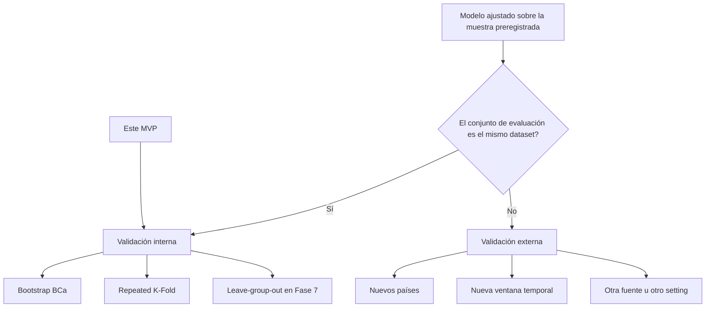
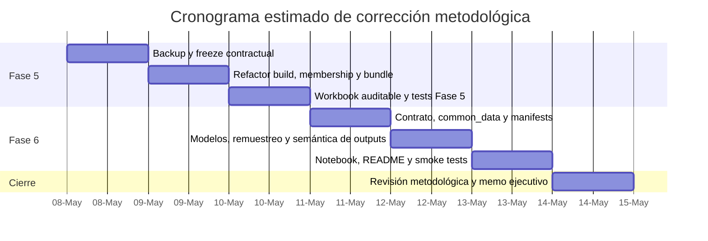

# Camino metodológico correcto para Research_AI_law

## Resumen ejecutivo

El camino correcto para esta investigación **no** es seguir “corrigiendo” un pipeline predictivo heredado, sino **cerrar definitivamente el paradigma predictivo** y formalizar el proyecto como un **estudio observacional comparativo de asociaciones ajustadas**, con Fase 5 como capa de preparación y contrato analítico, Fase 6 como capa de estimación inferencial por *outcome*, Fase 7 como robustez/sensibilidad y Fase 8 como traducción político-legislativa. Eso no implica partir de cero: el Excel actual muestra que la base sustantiva ya está bastante bien resuelta —43 países, 46 variables observadas, cobertura mínima de 41,86% y trazabilidad auditables—, pero también confirma que la capa técnica sigue contaminada por artefactos de `train/test split` que ya no corresponden a la pregunta real del estudio. [Fuente local: `MVP_AUDITABLE.xlsx`, hojas `0_Leer_Primero`, `3_Paises_43`, `10_Cobertura`, `11_Features_Fase6`, `11b_Features_Fase6_v2`, `12_Diccionario_Cols`; `5.PLAN_FASE_MVP_END_TO_END.md`, líneas 34–88 y 111–113; `6.PLAN_FASE5_V2.1_UPDATE.md`, líneas 17–25 y 208–329; `8.FASE6_V2.1_UPDATE.md`, líneas 18–29 y 280–405]. Un *split* aleatorio de un único conjunto de datos no es validación externa, sino una forma débil e ineficiente de validación interna; con muestras pequeñas, reduce el tamaño útil del desarrollo y deja pocos datos para evaluar. citeturn9search0turn9search1turn0search6turn0search8turn2search1turn2search4

La investigación previa ya había llegado cerca de esa conclusión: `new_met.md` era metodológicamente correcto en lo esencial, y el informe `deep-research-report.md` recomendó aceptarlo con modificaciones. Mi conclusión actual, incorporando además el Excel real de Fase 5, es más precisa: **el proyecto debe adoptar Fase 5 v2.1 y Fase 6 v2.1, pero con un fortalecimiento adicional en dos puntos que no están suficientemente resueltos en los blueprints**. El primero es reemplazar la lógica de “alta/baja adopción” por mediana como **resultado principal** en Q2/Q5/Q6, porque las variables disponibles son mayoritariamente porcentajes o *scores* continuos y la dicotomización destruye información; el segundo es formalizar una política explícita para **transformaciones no estimables** —por ejemplo, `z-scores` con MAD=0—, que hoy ya aparecen en el workbook. [Fuente local: `deep-research-report.md`, secciones “Resumen ejecutivo” y “Recomendación final”; `MVP_AUDITABLE.xlsx`, hoja `14_Transformaciones`; `5.PLAN_FASE_MVP_END_TO_END.md`, líneas 892–904]. La literatura metodológica es clara en ambos frentes: Altman y Royston desaconsejan dicotomizar variables continuas por la pérdida de eficiencia y distorsión analítica, y Papke & Wooldridge muestran que las variables fraccionales admiten modelos apropiados sin transformaciones ad hoc, incluso con valores en 0 y 1. citeturn11search0turn11search1turn11search2turn12search0turn12search7

Por tanto, la recomendación final es **modificar y ejecutar** la propuesta, no rechazarla ni dejarla en el estado actual. La Fase 5 correcta debe generar una **matriz técnica sin `split`**, un archivo `analysis_sample_membership.csv` como contrato central de muestra analítica y un bundle `phase6_ready` que impida reintroducir el holdout. La Fase 6 correcta debe estimar asociaciones ajustadas sobre la **muestra completa disponible por resultado**, usar **bootstrap BCa** y validación interna repetida, abandonar LOOCV para AUC/R², etiquetar todas las “predictions per country” como **scores descriptivos in-sample**, y reservar cualquier validación externa real para una fase posterior con nuevos datos, nuevos países o una nueva ventana temporal. [Fuente local: `6.PLAN_FASE5_V2.1_UPDATE.md`, líneas 159–205, 208–329 y 813–849; `8.FASE6_V2.1_UPDATE.md`, líneas 376–406, 423–520, 886–935 y 1010–1012]. SciPy documenta BCa como método por defecto para *bootstrap* y señala que el percentil, aunque intuitivo, rara vez es el preferido en práctica; scikit-learn documenta que `LeaveOneOut` usa *folds* de prueba unitarios y que \(R^2\) no está bien definido con menos de dos observaciones, lo que vuelve impropio reportar LOOCV para \(R^2\) y, por inferencia metodológica, también para AUC en *folds* de una sola observación. citeturn1search0turn1search5turn2search0turn2search5turn3search0

## Diagnóstico integrado de archivos y Excel

### Qué aportan los archivos base

Los documentos locales no compiten entre sí; se complementan. El plan maestro `5.PLAN_FASE_MVP_END_TO_END.md` ya corrige, a nivel de arquitectura, el error original de mezclar *split* predictivo con uso posterior de la muestra completa. El blueprint `6.PLAN_FASE5_V2.1_UPDATE.md` aterriza esa corrección en artefactos concretos de Fase 5. El blueprint `8.FASE6_V2.1_UPDATE.md` hace lo mismo para Fase 6. `new_met.md` resume bien el cambio de paradigma, y `deep-research-report.md` ya había concluido que el fondo de la propuesta era correcto, aunque incompleto en detalles operativos. [Fuente local: `5.PLAN_FASE_MVP_END_TO_END.md`, líneas 34–88, 111–113, 1668–1766 y 2026–2083; `6.PLAN_FASE5_V2.1_UPDATE.md`, líneas 17–25, 121–155, 159–329 y 813–849; `8.FASE6_V2.1_UPDATE.md`, líneas 18–29, 39–53, 57–97, 101–169, 280–405, 423–520, 544–606, 886–935 y 1010–1012; `new_met.md`, líneas 1–30; `deep-research-report.md`, secciones “Resumen ejecutivo”, “Síntesis de los archivos base” y “Recomendación final”].

| Insumo | Rol en la decisión | Qué ya resuelve | Qué sigue faltando o débil |
|---|---|---|---|
| `5.PLAN_FASE_MVP_END_TO_END.md` | Plan maestro F5–F8 | Declara estudio inferencial/comparativo, elimina holdout ficticio, mueve robustez a Fase 7, fija timeline global 14–18 h | Mantiene tensiones de nomenclatura 40/46 variables y algunos ejemplos de implementación aún perfectibles |
| `6.PLAN_FASE5_V2.1_UPDATE.md` | Especificación de Fase 5 corregida | Define `analysis_sample_membership.csv`, bundle sin split, contrato inferencial, tests y manifiestos | No incorpora una política explícita de exclusión de `z-scores` no estimables |
| `8.FASE6_V2.1_UPDATE.md` | Especificación de Fase 6 corregida | Elimina deuda de split, corrige LOOCV inválido, cambia semántica de outputs y tests | Conserva demasiada tolerancia a resultados binarizados en Q2/Q5/Q6 |
| `new_met.md` | Memo de reorientación estratégica | Resume bien el abandono del paradigma predictivo | Es demasiado resumido para sustituir a los blueprints |
| `deep-research-report.md` | Investigación metodológica previa | Concluye “aceptar con modificaciones” | No incorpora la inspección del Excel real |
| `MVP_AUDITABLE.xlsx` | Estado real de Fase 5 pre-corrección | Confirma que la base de 43 países y 46 variables existe y es auditable | Demuestra que aún sobreviven artefactos de split, narrativa legacy y algunas deudas de calidad operativa |

Fuente local de la tabla: archivos citados en esta sección, más `MVP_AUDITABLE.xlsx` inspeccionado en esta conversación.

### Qué demuestra el Excel actual de Fase 5

El libro `MVP_AUDITABLE.xlsx` confirma algo importante: **la investigación no está metodológicamente perdida**. La parte sustantiva ya está construida. La hoja `6_Matriz_40_Humana` contiene la matriz humana de 43 países y 46 variables observadas; `5_Variables_40` registra de hecho 46 variables V01–V46; `10_Cobertura` muestra que las 46 variables superan el umbral de 30% de cobertura y que la mínima observada es 41,86%; `13_Trazabilidad` y `14_Transformaciones` muestran que existe cultura de auditabilidad. [Fuente local: `MVP_AUDITABLE.xlsx`, hojas `5_Variables_40`, `6_Matriz_40_Humana`, `10_Cobertura`, `13_Trazabilidad`, `14_Transformaciones`].

El problema central del Excel es otro: la fase técnica todavía materializa el paradigma que ya se decidió abandonar. `11_Features_Fase6` y `11b_Features_Fase6_v2` contienen 138 columnas y una columna `split`; ambas hojas, además, son idénticas entre sí en el archivo actual. La hoja `0_Leer_Primero` todavía dice que esas matrices “incluyen transformaciones, agregados y split para modelado”; la hoja `9_Normalizacion` aún explica que la “partición train/test” pertenece a Data Preparation; y `12_Diccionario_Cols` registra `split` como `split_modelado` con la lectura humana “Indica si el país queda en train o test para modelado inicial”. [Fuente local: `MVP_AUDITABLE.xlsx`, hojas `0_Leer_Primero`, `9_Normalizacion`, `11_Features_Fase6`, `11b_Features_Fase6_v2`, `12_Diccionario_Cols`; inspección comparativa del libro].

Ese *split* no es solo teóricamente cuestionable; también es empíricamente sesgado en este archivo. Los 9 casos de `test` son Francia, Reino Unido, Bélgica, Italia, Bulgaria, Argentina, Colombia, México y Uruguay; por región, eso significa 5 casos europeos y 4 latinoamericanos, y **ninguno** de East Asia & Pacific, North America, MENA o South Asia. En otras palabras, el holdout actual no es un “test neutral”: ya encarna una composición geopolítica sesgada, exactamente el tipo de problema que `new_met.md` y el plan maestro buscaban evitar. [Fuente local: `MVP_AUDITABLE.xlsx`, hoja `11_Features_Fase6`; inspección de la columna `split` y cruce con `region`].

| Hallazgo del Excel actual | Evidencia | Implicancia |
|---|---|---|
| 43 países y 46 variables observadas ya consolidadas | `3_Paises_43`, `5_Variables_40`, `6_Matriz_40_Humana` | No hay que reabrir la curaduría de base |
| Cobertura mínima 41,86% para las 46 variables | `10_Cobertura` | La base es defendible para MVP; el cuello de botella no es la cobertura global |
| Matriz técnica con 138 columnas y `split` 34/9 | `11_Features_Fase6` y `11b_Features_Fase6_v2` | Fase 5 aún exporta una semántica predictiva que debe desaparecer |
| Hoja introductoria y diccionario aún hablan de split para modelado | `0_Leer_Primero`, `9_Normalizacion`, `12_Diccionario_Cols` | La deuda no es solo de código; también es documental |
| El test set está sesgado a Europa + LATAM | `11_Features_Fase6` | Refuerza la crítica a la validez del holdout |
| Seis transformaciones figuran como `zero_mad_or_not_estimable` | `14_Transformaciones` | Hace falta una regla explícita para excluir derivados degenerados de los modelos primarios |
| Taiwan carece de `region`/`income_group` comparables | `0_Leer_Primero`, `8_Casos_Atencion` | El archivo de membresía debe incluir banderas de metadata incompleta y una política explícita de sensibilidad |

Fuente local de la tabla: `MVP_AUDITABLE.xlsx`, hojas indicadas.

### Supuestos necesarios donde el material no especifica

Hay varias piezas que el material no especifica completamente y que, por transparencia, deben declararse como supuestos de trabajo. La primera es que Fase 3 y Fase 4 siguen siendo accesibles en modo solo lectura y no requieren recuración adicional. La segunda es que el Excel refleja fielmente el estado real de Fase 5 actual y no un export parcial. La tercera es que las variables tipo porcentaje pueden reescalarse a \([0,1]\) cuando convenga usar modelos fraccionales. La cuarta es que el proyecto no exige, en esta iteración, una afirmación causal fuerte ni una capacidad predictiva externa. La quinta es que la presión principal del usuario es producir inferencias comparativas útiles para discusión de política pública, no un clasificador de países nuevos. [Fuente local: `5.PLAN_FASE_MVP_END_TO_END.md`, líneas 95–113 y 2091–2118; `6.PLAN_FASE5_V2.1_UPDATE.md`, líneas 17–25 y 136–155; `8.FASE6_V2.1_UPDATE.md`, líneas 18–29 y 1010–1012].

## Transcripción exacta de new_met

```text
La reestructuración de la arquitectura del proyecto `5.PLAN_FASE_MVP_END_TO_END.md` debe centrarse en un cambio de paradigma fundamental: **abandonar la lógica predictiva de "caja negra" (train/test split) y formalizar el pipeline como un estudio inferencial-comparativo observacional**.

Dado que tu muestra es pequeña ($N=43$) y el objetivo es informar la política pública chilena sobre asociaciones estadísticas, esta es la reestructuración recomendada para cada fase del pipeline:

### 1. Reestructuración de Fase 5: De Partición a Membresía
La arquitectura ya no debe "amputar" el 20% de tus datos (9 países) para un test set que sería estadísticamente inestable y geopolíticamente sesgado.
*   **Eliminación de artefactos predictivos:** Debes eliminar la creación de `phase6_train_test_split.csv` y cualquier columna llamada `split` en la matriz de características.
*   **Nueva tabla de membresía (`analysis_sample_membership.csv`):** Este archivo se convierte en el contrato central. Debe documentar explícitamente la pertenencia de los 43 países y definir **flags de sensibilidad** (región, nivel de ingresos, líderes en IA como EE. UU. o China).
*   **Contrato Inferencial:** El archivo `phase6_modeling_contract.yaml` debe declarar explícitamente `use_holdout_test_set: false` y definir el alcance como `full_preregistered_sample`.

### 2. Reestructuración de Fase 6: Estimación de Asociaciones Ajustadas
En lugar de buscar maximizar métricas *out-of-sample* (como AUC o $R^2$ en un test set pequeño), el modelado debe centrarse en la **precisión de los coeficientes y la medición de la incertidumbre**.
*   **Uso de la muestra completa:** Cada módulo (Inversión, Adopción, Innovación) debe usar todos los países disponibles para ese resultado específico (outcome), aplicando `dropna()` solo sobre las columnas necesarias y reportando siempre el **$n_{effective}$**.
*   **Validación interna vía Bootstrap:** La arquitectura debe incorporar el remuestreo (bootstrap) como la herramienta principal para generar **intervalos de confianza (IC95)** para los coeficientes regulatorios.
*   **Cambio Semántico en los Resultados:** Los archivos de salida, como `*_predictions_per_country.csv`, deben renombrarse o etiquetarse internamente como **"scores descriptivos in-sample"** o **"posicionamiento relativo"**, reconociendo honestamente que esos países ayudaron a definir los parámetros del modelo.

### 3. Reestructuración de Fase 7: De Validación a Análisis de Sensibilidad
Esta fase deja de ser un "trámite" de métricas de error y se convierte en el **guardián de la robustez científica** del estudio.
*   **Pruebas de Estrés (Sensitivity Analysis):** La arquitectura debe ejecutar análisis de tipo *Leave-Group-Out*. Esto implica reportar qué sucede con la asociación entre regulación y ecosistema si excluyes a los líderes (USA/China) o si dejas fuera a una región completa (ej. LATAM).
*   **Comparación con Baselines Triviales:** Debes demostrar que tus variables regulatorias aportan más información que un modelo simple basado solo en controles socioeconómicos como el PIB.

### 4. Gobernanza Técnica y API
Para asegurar que este cambio metodológico sea auditable, la estructura de directorios y el flujo de datos deben ser rígidos:
*   **Inmutabilidad de Fases Previas:** El MVP solo debe "leer" de las Fases 3 y 4 a través de APIs internas (`src.fase3.api`), garantizando que la preparación de datos no contamine la base de datos original.
*   **Centralización de Decisiones:** Todas las correcciones metodológicas deben quedar firmadas en un archivo `mvp_decisions.yaml` que sirva como bitácora de auditoría para stakeholders políticos.

### Resumen del Flujo de Valor
Con esta arquitectura reestructurada, el entregable final en **Fase 8** ya no dirá "predigo que Chile tendrá X inversión", sino: **"Se observa una asociación ajustada de magnitud Y entre el tipo de regulación y la innovación, que se mantiene estable incluso al excluir outliers, lo que fundamenta la recomendación de un enfoque regulatorio específico para el Boletín 16821-19"**.

Este enfoque protege tu credibilidad ante el Senado o Ministerios al no vender una capacidad predictiva que una muestra de $N=43$ no puede sostener técnicamente.
```

Fuente local: `new_met.md`, líneas 1–30.

## Camino metodológico correcto

### Qué tipo de estudio debe ser realmente

El estudio debe declararse, sin ambigüedad, como un **estudio observacional comparativo, con estimación primaria de asociaciones ajustadas**, no como un estudio de predicción externa y tampoco como un estudio causal fuerte. Esa definición importa porque determina el lenguaje, el checklist de reporte, la arquitectura técnica y el estándar con el que será juzgado por terceros. TRIPOD y TRIPOD-Cluster son muy útiles para la parte de validación interna y para explicar por qué el *split-sample* heredado es un error; pero el propio TRIPOD aclara que no está pensado para modelamiento multivariable en estudios etiológicos, mientras que STROBE sí está diseñado para el reporte transparente de estudios observacionales. Dicho en simple: **para justificar el abandono del split hay que leer a TRIPOD/Steyerberg/Harrell; para reportar el estudio final hay que apoyar la narrativa en STROBE**. citeturn4search1turn9search0turn9search1turn0search6turn0search8turn2search1turn2search4turn1search3turn10search13

Eso, además, mejora la utilidad política. Un actor público serio no necesita que el estudio “adivine” el futuro de Chile con una muestra de 43 países; necesita saber si ciertos rasgos regulatorios aparecen consistentemente asociados con inversión, adopción, innovación o capacidad pública, cuánta incertidumbre hay, cuán robusto es el patrón al excluir grandes potencias o regiones, y dónde se ubica Chile dentro de esa foto comparada. Ese enfoque es más veraz frente a la evidencia observacional y más defendible ante auditorías técnicas y debate legislativo. citeturn6search12turn1search3turn10search13

### Qué debe cambiar para maximizar validez, transparencia y utilidad política

El primer cambio imprescindible es **eliminar por completo el *split*** y reemplazarlo por un contrato explícito de muestra analítica. Esto no es cosmético. El Excel actual prueba que el `split` sigue organizado como columna, tipo de diccionario y narrativa de workbook; por lo tanto, todavía puede contaminar notebooks, tests, interpretaciones y el relato político. El archivo correcto para reemplazarlo es `analysis_sample_membership.csv`, con banderas de sensibilidad y gobernanza —no de `train`/`test`—, tal como ya plantean los blueprints de Fase 5 y Fase 6. [Fuente local: `MVP_AUDITABLE.xlsx`, hojas `0_Leer_Primero`, `11_Features_Fase6`, `12_Diccionario_Cols`; `6.PLAN_FASE5_V2.1_UPDATE.md`, líneas 208–329 y 433–447; `8.FASE6_V2.1_UPDATE.md`, líneas 280–405].

El segundo cambio es **usar la muestra completa disponible por resultado**, con `dropna()` solo sobre el conjunto de columnas indispensable para cada modelo y reporte obligatorio de `n_effective`. Ese principio ya está bien instalado en el plan maestro y en Fase 6 v2.1, y coincide con la bibliografía: el objetivo, con N=43 y outcomes heterogéneos, no es “maximizar AUC/R² en test”, sino medir asociaciones con incertidumbre y evitar desperdiciar observaciones. La validación permanece interna, no externa. [Fuente local: `5.PLAN_FASE_MVP_END_TO_END.md`, líneas 80–88, 1079–1358; `8.FASE6_V2.1_UPDATE.md`, líneas 39–53 y 376–406]. La literatura metodológica avala exactamente esa dirección. citeturn9search0turn9search1turn0search6turn0search8turn2search1turn2search4

El tercer cambio, y aquí es donde propongo ir un paso más allá que los blueprints, es **dejar de usar la dicotomización alta/baja por mediana como resultado principal** en Q2, Q5 y parte de Q6. El Excel muestra que esas variables son porcentajes (`ms_h2_2025_ai_diffusion_pct`, `anthropic_usage_pct`, `oecd_5_ict_business_oecd_biz_ai_pct`) o *scores* continuos 0–100 (`oxford_public_sector_adoption`, `oxford_ind_adoption_emerging_tech`), no variables naturalmente binarias. [Fuente local: `MVP_AUDITABLE.xlsx`, hoja `5_Variables_40`]. Altman y Royston subrayan que agrupar variables continuas tiene costos serios y es innecesario para el análisis estadístico; Papke y Wooldridge muestran que, para respuestas fraccionales, existen métodos adecuados que no exigen transformaciones arbitrarias y manejan naturalmente valores extremos. Por eso, recomiendo que la **estimación primaria** para porcentajes y *scores* sea continua o fraccional según la escala, y que la versión binaria “alta/baja” quede relegada a análisis de sensibilidad o comunicación secundaria. citeturn11search0turn11search1turn11search2turn12search0turn12search7

El cuarto cambio es **mejorar la política de remuestreo**. `new_met.md` acierta al poner el *bootstrap* en el centro, pero yo lo afinaría a **BCa por defecto** para intervalos de confianza, con repetición de todo el pipeline de Fase 6 que dependa de la muestra analítica del *outcome*: selección completa de casos válidos, codificación/estandarización diseñada para ese modelo, ajuste, y cualquier tuning permitido. SciPy documenta BCa como método por defecto y señala que el percentil rara vez es el preferido en práctica; Harrell insiste en que la validación honesta con resampling repite el proceso de desarrollo, no solo el modelo final. citeturn1search0turn1search5turn2search4turn9search0

El quinto cambio es **separar nítidamente validación interna de validación externa**. Repeated K-fold y *bootstrap* son válidos aquí; un nuevo dataset por país, por período temporal o por fuente sería la verdadera validación externa. TRIPOD-Cluster es muy explícito: un *random split* de un solo dataset no debe venderse como external validation. Por consiguiente, si en el futuro el proyecto quiere abrir una línea predictiva o de generalización, eso debe ir a una fase posterior, no maquillarse dentro del MVP actual. citeturn9search0turn9search1


El diagrama resume el cambio correcto: no es “nueva IA”, sino un pipeline analítico coherente con la pregunta legislativa real. [Fuente local: `5.PLAN_FASE_MVP_END_TO_END.md`, líneas 238–312; `6.PLAN_FASE5_V2.1_UPDATE.md`, líneas 208–329; `8.FASE6_V2.1_UPDATE.md`, líneas 376–406].

### Comparativa entre el estado actual y el estado propuesto

| Criterio | Estado actual observado | Estado propuesto correcto |
|---|---|---|
| Eficiencia | Pierde 9/43 países en un `test` que luego no cumple función de validación externa | Usa la muestra completa disponible por outcome |
| Calidad analítica | Mezcla inferencia con narrativa predictiva legacy | Pregunta, contrato, outputs y validación quedan alineados |
| Costo | **No especificado** | **No especificado** |
| Tiempo | **No especificado** | **No especificado** en documentos; inferencia razonada más abajo |
| Riesgos | Falso holdout, sesgo geopolítico del test, posible sobrelectura causal/predictiva | Mantiene límites de N pequeño, pero elimina el falso test y mejora trazabilidad |
| Escalabilidad | Mala: el pipeline sigue atado a un paradigma equivocado | Mejor: deja abierta una validación externa futura real |
| Complejidad | Más simple en apariencia, pero metodológicamente incoherente | Algo más compleja en contratos y tests, pero científicamente correcta |
| Utilidad política | Alto riesgo de sobreventa | Alta credibilidad: asociaciones, incertidumbre, robustez y posicionamiento relativo |

La mejor práctica, por tanto, no es sostener el estado actual; es migrar a la columna derecha de la tabla. Esa transición está respaldada por los archivos del proyecto y por la bibliografía metodológica citada. [Fuente local: archivos ya mencionados]. citeturn9search0turn0search6turn0search8turn2search1turn11search0turn12search0

## Nueva Fase 5

### Qué debe ser la Fase 5 correcta

La nueva Fase 5 debe ser una **fase de preparación auditable y contractual**, no una fase de “pre-modelado predictivo”. Su trabajo no es decidir quién va a `train` y quién a `test`, sino congelar de manera transparente la muestra, las variables observadas, las derivaciones permitidas, la política de faltantes, la membresía analítica y el bundle de entrada de Fase 6. Esta visión ya aparece en el blueprint v2.1, y el Excel actual demuestra que, salvo el `split`, gran parte de esa estructura ya existe. [Fuente local: `6.PLAN_FASE5_V2.1_UPDATE.md`, líneas 15–27, 159–205 y 208–329; `MVP_AUDITABLE.xlsx`, hojas `3_Paises_43`, `5_Variables_40`, `10_Cobertura`, `13_Trazabilidad`, `14_Transformaciones`].

### Pipeline correcto paso a paso

| Paso | Qué debe hacer Fase 5 | Artefactos principales | Punto de control |
|---|---|---|---|
| Backup | Respaldar outputs pre-corrección | `outputs.v2.0.pre_methodology_correction/` | Si no hay backup, se aborta |
| Freeze de muestra | Congelar 43 países preregistrados | `mvp_countries.csv` | 43 filas únicas |
| Freeze de variables | Congelar 46 variables observadas reales | `mvp_variables_catalog.csv` | 46 variables, no 40 nominales ambiguas |
| Matriz humana | Generar matriz 43x46 legible para auditoría humana | `feature_matrix_human` / Excel | No contiene `split` |
| Matriz técnica | Generar *features* técnicas para Fase 6 | `feature_matrix_mvp.csv` | No contiene `split`; metadata separada |
| Cobertura y trazabilidad | Exportar cobertura, missingness y trazabilidad | `coverage_report_mvp.csv`, trazabilidad | Todas las métricas reproducibles |
| Transformaciones | Exportar parámetros y estado de derivaciones | `mvp_transform_params.csv` | `zero_mad_or_not_estimable` documentado |
| Membresía analítica | Crear contrato de pertenencia y sensibilidad | `analysis_sample_membership.csv` | 43 filas; cero columnas tipo `train/test` |
| Bundle Fase 6 | Exportar paquete completo para modelado | `phase6_ready/` | Sin `phase6_train_test_split.csv` |
| Gobernanza | Firmar decisiones y hashes | `mvp_decisions.yaml`, `fase5_manifest.json`, `phase6_ready_manifest.json` | Manifiestos y hashes coherentes |
| Excel auditable | Regenerar workbook con narrativa corregida | `MVP_AUDITABLE.xlsx` | Sin lenguaje de `split para modelado` |

Fuente local: `6.PLAN_FASE5_V2.1_UPDATE.md`, líneas 159–205, 208–329, 369–447, 463–746 y 813–849.

### Contrato y archivos que realmente debería entregar

Los archivos canónicos de Fase 5 v2.1 deben mantenerse muy cerca del blueprint ya escrito, con una mejora adicional: el contrato debe incorporar una **política explícita para transformaciones no estimables** y para **casos especiales de metadata**, como Taiwan. Así quedaría el corazón del contrato, en términos normativos:

```yaml
version: "0.3"
fase5_version: "2.1"
methodology: "inferential_comparative_observational"
primary_estimand: "adjusted_association"

sample_policy:
  n_primary_sample: 43
  use_holdout_test_set: false
  train_test_split_created: false
  split_column_present: false
  effective_n_rule: "listwise_deletion_per_model_on_required_y_x"
  primary_analysis_scope: "full_preregistered_sample_available_by_outcome"

validation_policy:
  primary_uncertainty: "bootstrap_bca_confidence_intervals"
  internal_validation:
    - repeated_kfold_cv
  loocv_reporting: "developer_only_when_metric_defined"
  robustness_phase: "FASE7"
  external_validation_available: false

transform_policy:
  zero_mad_behavior: "exclude_non_estimable_derived_cols_from_primary_models"
  preserve_raw_variables: true

special_cases:
  - iso3: "TWN"
    metadata_comparability: "incomplete_region_income"
    sensitivity_policy: "document_and_optionally_exclude_from_group_leave_out"

language_policy:
  allowed:
    - association
    - adjusted association
    - internal validation
    - sensitivity
    - robustness
    - effective_n
  forbidden_without_extra_design:
    - causal effect
    - external validation
    - test set independiente
    - independent prediction
```

Este esquema es coherente con los blueprints de Fase 5 y Fase 6 y agrega dos mejoras justificadas por el Excel real: controlar `z-scores` degenerados y explicitar la excepción de Taiwan. [Fuente local: `6.PLAN_FASE5_V2.1_UPDATE.md`, líneas 208–329 y 433–447; `8.FASE6_V2.1_UPDATE.md`, líneas 280–405; `MVP_AUDITABLE.xlsx`, hojas `8_Casos_Atencion` y `14_Transformaciones`]. El uso de BCa como default está respaldado por la documentación oficial de SciPy. citeturn1search0turn1search5

La tabla de membresía tampoco debería limitarse a región e ingreso. Dado lo que ya existe en el workbook, conviene incluir `sample_inclusion_category`, `is_chile_focal`, `is_ai_leader_sensitivity`, `is_latam_peer_sensitivity`, `is_large_ai_power_sensitivity`, `leave_group_region`, `leave_group_income`, `has_comparable_region_income` y una columna `notes`. Eso alinea la membresía con el uso real que la fase posterior necesita para robustez y auditoría. [Fuente local: `6.PLAN_FASE5_V2.1_UPDATE.md`, líneas 296–329 y 433–447; `MVP_AUDITABLE.xlsx`, hojas `3_Paises_43` y `8_Casos_Atencion`].

### Cómo debe cambiar el Excel auditable

El Excel actual es rescatable, pero no debe publicarse como versión metodológicamente final. Necesita una actualización de narrativa y, en algunos puntos, de estructura. En particular, no basta con borrar la columna `split` del CSV; hay que **descontaminar el workbook** para que un auditor humano no herede un mensaje metodológico obsoleto. [Fuente local: `MVP_AUDITABLE.xlsx`, hojas `0_Leer_Primero`, `9_Normalizacion`, `12_Diccionario_Cols`; `6.PLAN_FASE5_V2.1_UPDATE.md`, líneas 599–617].

| Elemento actual del workbook | Cambio correcto |
|---|---|
| `0_Leer_Primero` dice que las hojas técnicas incluyen “split para modelado” | Reemplazar por “transformaciones, agregados y flags de muestra analítica; no existe test set independiente” |
| `9_Normalizacion` habla de “partición train/test” como parte de Data Preparation | Reescribir para decir que Fase 5 prepara datos y contrato; la validación interna ocurre por remuestreo en Fase 6/7 |
| `12_Diccionario_Cols` incluye una fila `split` con tipo `split_modelado` | Eliminar esa fila |
| `11_Features_Fase6` y `11b_Features_Fase6_v2` son duplicadas e idénticas | Unificar o repurposar una de ellas para `Muestra_Analitica_v2_1` |
| `5_Variables_40` y `6_Matriz_40_Humana` tienen nombres legacy aunque contienen 46 variables | Renombrar o, si se conservan por compatibilidad, agregar aclaración frontal inequívoca de que el contenido real es 46 |
| No existe hoja dedicada a la muestra analítica | Agregar hoja tipo `Muestra_Analitica_v2_1` con flags de sensibilidad y notas de casos especiales |

Fuente local: `MVP_AUDITABLE.xlsx`, hojas señaladas; inspección del libro.

### Tests mínimos que Fase 5 debe pasar

| Test | Qué debe verificar |
|---|---|
| `test_no_train_test_outputs_exist` | No existe `mvp_train_test_split.csv` ni `phase6_train_test_split.csv` |
| `test_feature_matrix_has_no_split_column` | `feature_matrix_mvp.csv` no contiene `split` |
| `test_analysis_sample_membership_contract` | 43 filas, 43 ISO3 únicos, `is_primary_analysis_sample = true`, sin columnas prohibidas |
| `test_phase6_contract_no_holdout` | `use_holdout_test_set=false`, `train_test_split_created=false`, `split_column_present=false` |
| `test_phase6_bundle_has_membership_not_split` | Existe `phase6_analysis_sample_membership.csv` y no existe `phase6_train_test_split.csv` |
| `test_non_estimable_transforms_flagged` | Toda derivación con MAD=0 está marcada y excluida de los grupos de modelado primario |
| `test_workbook_no_holdout_language` | El Excel no usa “split para modelado”, “train/test”, “holdout” como semántica operativa |

Los cinco primeros tests ya están muy alineados con el blueprint; los dos últimos son los que yo agregaría a partir de la evidencia del workbook actual. [Fuente local: `6.PLAN_FASE5_V2.1_UPDATE.md`, líneas 621–695 y 813–849; `MVP_AUDITABLE.xlsx`, hojas `0_Leer_Primero`, `12_Diccionario_Cols`, `14_Transformaciones`].

## Nueva Fase 6

### Qué debe ser la Fase 6 correcta

La nueva Fase 6 debe ser una **fase de estimación de asociaciones ajustadas y de validación interna honesta**, no una fase de “performance on test”. Su primer trabajo es validar el contrato recibido desde Fase 5; su segundo trabajo, construir diseños analíticos por pregunta y por *outcome*; su tercer trabajo, estimar el resultado primario con incertidumbre; y su cuarto trabajo, generar outputs legibles, semánticamente honestos y compatibles con Fase 8. [Fuente local: `8.FASE6_V2.1_UPDATE.md`, líneas 16–29, 57–97, 280–405 y 489–520].

### Estrategia analítica correcta por pregunta

Aquí es donde propongo la principal mejora sustantiva sobre el blueprint actual. La Fase 6 “realmente correcta” no debería tratar todas las preguntas igual, porque los tipos de *outcome* no son iguales.

| Pregunta | Escala de outcome en los archivos locales | Resultado principal recomendable | Sensibilidades razonables | Qué no debe ser headline |
|---|---|---|---|---|
| Q1 Inversión | *Scores* y conteos/índices transformados | OLS o regresión lineal parsimoniosa con IC bootstrap BCa para coeficientes regulatorios | Ridge/Lasso CV interna; RF solo auxiliar si se mantiene | RF como resultado principal |
| Q2 Adopción | Porcentajes y *scores* 0–100 | Modelo continuo o fraccional según variable; asociaciones ajustadas sobre escala original o reescalada | Clasificación alta/baja solo como sensibilidad | Clasificación por mediana como resultado principal |
| Q3 Innovación | *Scores* 0–100 y conteos transformados | OLS/lineal parsimoniosa con bootstrap BCa | Ridge o GBR solo como chequeo auxiliar | “Predicción” de innovación fuera de muestra |
| Q4 Perfil regulatorio | No supervisado | Clustering descriptivo y estabilidad de clústeres | Sensibilidad a \(k\), distancia y exclusión de outliers | Cualquier noción de test/train |
| Q5 Uso IA población | Porcentajes/reuso de variables de adopción | Igual que Q2: continuo o fraccional como principal | Binaria solo como sensibilidad | Probabilidades interpretadas como predicciones independientes |
| Q6 Uso IA sector público | *Scores* públicos y métricas de gobernanza digital | Modelo continuo lineal como principal | Clasificación alta/baja, si se usa, solo secundaria | Clasificación binaria como foco sustantivo |

La razón más importante para este rediseño es que el Excel no ofrece outcomes “naturalmente binarios” para Q2/Q5/Q6; ofrece variables continuas o porcentuales. La binarización por mediana simplifica, pero a costa de validez y potencia. Eso no significa prohibirla por completo; significa **sacarla del centro**. citeturn11search0turn11search1turn11search2turn12search0turn12search7

### Qué remuestreo y qué validación interna deben usarse

La política correcta de validación interna en Fase 6 es esta: **bootstrap BCa para incertidumbre de coeficientes** y **Repeated K-Fold para métricas diagnósticas internas**. Si se mantiene LOOCV, debe ser solo una herramienta de *debugging* o de chequeo secundario cuando la métrica esté definida, no un número de primer orden en outputs ni notebooks. [Fuente local: `8.FASE6_V2.1_UPDATE.md`, líneas 253–263, 423–520 y 886–935]. Esta preferencia está directamente respaldada por la literatura sobre validación interna y por la documentación técnica. citeturn9search0turn0search6turn0search8turn2search1turn2search4turn1search0turn2search0turn2search5turn3search0

Una consecuencia operacional clave es que el *bootstrap* debe repetir el pipeline **aguas abajo de Fase 5** para cada *outcome*: complete-case selection por conjunto \(Y + X\), ajuste del modelo, y cualquier paso de tuning o codificación que dependa de la muestra del modelo. Si se usa un enfoque de clasificación secundaria con umbral, ese umbral también debe tratarse como parte del proceso analítico y no como una verdad fija no auditada. Esta recomendación sigue el criterio de Harrell y el espíritu de TRIPOD-Cluster respecto a que la validación interna honesta debe reflejar el proceso real de desarrollo del modelo. citeturn2search4turn9search0



Este punto debe quedar clarísimo en notebook, README y outputs: **este MVP solo hace validación interna y sensibilidad; no hace validación externa real**. citeturn9search0turn9search1

### Qué cambios técnicos específicos debe incorporar Fase 6

El blueprint de Fase 6 ya acierta en mucho, y ahí conviene ser conservador: reemplazar `get_train_test_split()` por `get_analysis_sample_membership()`, validar el contrato inferencial, emitir `analysis_scope`, `validation_scope` y `holdout_used=false`, y reetiquetar los archivos `*_predictions_per_country.csv` como resultados descriptivos in-sample. Eso está bien y debe mantenerse. [Fuente local: `8.FASE6_V2.1_UPDATE.md`, líneas 280–406 y 764–809].

Yo agregaría cuatro decisiones técnicas concretas más. La primera: **no incluir en diseño primario columnas derivadas con `zero_mad_or_not_estimable`**, aunque sí dejarlas documentadas en el bundle y el workbook. La segunda: **rebajar la clasificación Q2/Q5/Q6 a sensibilidad** y crear tablas de resultados principales continuos/fraccionales. La tercera: **no reportar LOOCV para AUC ni R²** y, más aún, no darle presencia visible en outputs ejecutivos. La cuarta: **añadir una política explícita de semántica de score**, de modo que toda tabla por país cargue `score_scope="in_sample_descriptive_positioning"` e `independent_prediction=false`. [Fuente local: `MVP_AUDITABLE.xlsx`, hoja `14_Transformaciones`; `8.FASE6_V2.1_UPDATE.md`, líneas 403–406, 423–520, 864–867 y 903–906]. La parte de BCa y LOOCV tiene respaldo directo en la documentación oficial de SciPy y scikit-learn. citeturn1search0turn2search0turn2search5turn3search0

### Outputs correctos y tests obligatorios

| Archivo de salida | Cómo debe quedar |
|---|---|
| `q1_results.csv` | Coeficientes, IC95 BCa, `n_effective`, `analysis_scope`, `validation_scope`, `holdout_used=false` |
| `q2_results.csv` | Resultado principal continuo o fraccional; si hay binaria, marcada como sensibilidad |
| `q2_predictions_per_country.csv` | Se mantiene por compatibilidad, pero con `score_scope="in_sample_descriptive_positioning"` e `independent_prediction=false` |
| `q3_results.csv` | Igual que Q1, con semántica de asociación ajustada |
| `q4_clusters.csv` | Clustering descriptivo sin semántica de holdout |
| `q5_results.csv` | Igual lógica que Q2 |
| `q5_predictions_per_country.csv` | Igual semántica de score descriptivo |
| `q6_results.csv` | Resultado principal continuo; clasificación solo secundaria si se conserva |
| `q6_predictions_per_country.csv` | Igual semántica de score descriptivo |
| `fase6_manifest.json` | `methodology=inferential_comparative_observational`, `holdout_used=false`, `train_test_split_used=false`, `analysis_sample_n=43` |
| `README.md` y notebook | Deben abrir con contrato inferencial, no con train/test |

| Test de Fase 6 | Qué debe verificar |
|---|---|
| `test_no_holdout_methodology.py` | No existe split ni holdout en bundle, contract y manifest |
| `test_membership_contract.py` | La membresía existe, tiene 43 filas y no contiene columnas prohibidas |
| `test_outputs_no_causal_language.py` | No aparecen “test set independiente”, “predicción independiente”, “efecto causal” |
| `test_score_scope_in_country_outputs.py` | Q2/Q5/Q6 per-country llevan `score_scope` e `independent_prediction=false` |
| `test_no_loocv_auc_r2.py` | No se computa LOOCV para AUC o R² |
| `test_primary_models_exclude_nonestimable_transforms.py` | Diseños primarios no usan columnas con MAD=0 |
| `test_contract_validation_runs_on_startup.py` | `run_all.py` falla si aparece `split` o si el bundle incumple contrato |

Fuente local de ambas tablas: `8.FASE6_V2.1_UPDATE.md`, líneas 544–606, 764–809 y 886–935, con extensiones recomendadas por este informe a partir del workbook actual.

## Implementación, recursos y riesgos

### Entregables concretos

El trabajo correcto no termina con modificar dos scripts. Debe dejar un paquete profesional cerrable y auditable. Los entregables concretos que yo exigiría son los siguientes:

| Entregable | Estado esperado |
|---|---|
| `FASE5/outputs/feature_matrix_mvp.csv` | Regenerado sin `split` |
| `FASE5/outputs/analysis_sample_membership.csv` | Creado y validado |
| `FASE5/outputs/phase6_ready/phase6_modeling_contract.yaml` | Regenerado con política inferencial y BCa |
| `FASE5/outputs/MVP_AUDITABLE.xlsx` | Regenerado con narrativa v2.1 y sin semántica train/test |
| `FASE5/fase5_manifest.json` | Actualizado con `train_test_split_removed=true` |
| `FASE6/outputs/q1-q6_results.csv` | Regenerados con metadatos de alcance y holdout |
| `FASE6/outputs/*_predictions_per_country.csv` | Mismos nombres si es necesario, pero semántica corregida |
| `FASE6/outputs/fase6_manifest.json` | Regenerado con metodología v2.1 |
| `FASE6/notebooks/06_modeling.ipynb` | Regenerado, no editado manualmente |
| `FASE5_CIERRE_TECNICO.md` y memo metodológico corto | Explican la corrección para auditor técnico y stakeholder político |

Fuente local: `6.PLAN_FASE5_V2.1_UPDATE.md`, líneas 159–205 y 748–766; `8.FASE6_V2.1_UPDATE.md`, líneas 764–809 y 959–1004.

### Timeline estimado

Documentalmente, el único cronograma explícito en los archivos es el del plan maestro: **14–18 horas** para el MVP F5–F8 completo. Los blueprints de actualización de Fase 5 y Fase 6 no entregan un tiempo incremental propio. Por eso, el tiempo específico del *update* debe declararse como **no especificado** en la documentación original. [Fuente local: `5.PLAN_FASE_MVP_END_TO_END.md`, líneas 1955–1987].

Como **inferencia razonada** —y separándola explícitamente del dato documental—, yo estimaría lo siguiente para la corrección bien hecha, incluyendo el refuerzo metodológico que propongo aquí:

| Frente | Tiempo documental | Tiempo inferido |
|---|---|---|
| Corrección Fase 5 base | No especificado | 6–10 horas |
| Corrección Fase 6 base | No especificado | 10–14 horas |
| Mejora adicional Q2/Q5/Q6 + BCa + tests extra | No especificado | 8–16 horas |
| Regeneración de notebook, README y memo metodológico | No especificado | 4–8 horas |
| Total | No especificado | 24–40 horas |



### Recursos y capacitación necesarios

| Recurso | Perfil | Carga estimada |
|---|---|---|
| Responsable metodológico | Estadístico/DS con criterio en remuestreo, inferencia observacional y semántica de resultados | 12–16 h |
| Responsable técnico | Analista o research engineer con manejo de YAML, tests, manifests, notebooks y Excel | 10–14 h |
| Revisión sustantiva | Investigador principal / policy lead | 2–4 h |
| Capacitación mínima | Taller corto sobre asociación vs causalidad, validación interna vs externa, y lectura de outputs in-sample | 2–3 h |

La capacitación no es un accesorio. STROBE insiste en que los lectores necesitan saber qué se planeó, qué se hizo, qué se encontró y qué significan los resultados; y la literatura de causalidad observacional insiste en no sobrerreivindicar efectos sin diseño causal explícito. En este proyecto, esa disciplina interpretativa es tan importante como el código. citeturn1search3turn10search13turn6search12

### Riesgos residuales y mitigaciones

Incluso con la corrección propuesta, el proyecto no queda libre de riesgos; queda **honesto** respecto de ellos.

| Riesgo residual | Por qué sigue existiendo | Mitigación |
|---|---|---|
| N pequeño por outcome | Aunque se usa toda la muestra, algunos modelos bajarán por `dropna()` | Modelos parsimoniosos, `n_effective` visible, no sobreinterpretar |
| No hay validación externa real | El proyecto usa un único conjunto comparativo | Declararlo explícitamente y reservar validación externa para fase futura |
| Heterogeneidad geopolítica | Países muy distintos y con outliers claros | Fase 7 leave-group-out por región, líderes IA y submuestras |
| Metadata incompleta de Taiwan | Región e ingreso no comparables | Flag especial en membership y sensibilidad con/sin TWN |
| Transformaciones degeneradas | Ya hay 6 derivaciones con MAD=0 | Excluirlas de modelos primarios y dejar trazabilidad |
| Riesgo de sobreventa política | Los stakeholders pueden leer scores como predicciones | Reetiquetar outputs y blindar README/notebook/manifest |
| Complejidad de mantenimiento | Más contratos y tests implican más disciplina | Gobernanza fuerte, manifests, hashes y cero edición manual del notebook |

TRIPOD-Cluster recuerda, además, que el desempeño y la generalización de un modelo pueden variar entre clústeres o *settings*, y que la verdadera evaluación de generalización requiere datos que no hayan sido usados para desarrollar el modelo. Ese riesgo seguirá abierto hasta que exista una validación realmente externa. citeturn9search0turn9search1

### Recomendación final

Mi recomendación final es **no seguir con el pipeline actual** y **no limitarse a una corrección mínima cosmética**. El camino correcto es este:

Primero, **congelar Fase 5 como fase de muestra + variables + trazabilidad + contrato**, eliminando todo artefacto `split` y creando `analysis_sample_membership.csv` como núcleo de gobernanza. Segundo, **replantear Fase 6 como capa inferencial por outcome**, donde Q1/Q3/Q6 usen modelos continuos parsimoniosos con IC bootstrap BCa, Q2/Q5 utilicen resultados continuos o fraccionales como principal, y toda clasificación binaria quede como sensibilidad secundaria. Tercero, **blindar la semántica de outputs** para impedir que un score descriptivo se lea como predicción independiente. Cuarto, **mover la discusión de robustez a Fase 7** y dejar la validación externa para cuando exista fuente, tiempo o país nuevo. [Fuente local: `5.PLAN_FASE_MVP_END_TO_END.md`, líneas 34–88 y 2147–2148; `6.PLAN_FASE5_V2.1_UPDATE.md`, líneas 208–329 y 813–849; `8.FASE6_V2.1_UPDATE.md`, líneas 376–406, 423–520 y 1010–1012]. Ese camino es el más congruente con la evidencia metodológica, con el material ya producido y con la credibilidad política que el proyecto necesita. citeturn9search0turn0search6turn2search1turn11search0turn12search0turn6search12

## Referencias

### Fuentes locales del proyecto

- `5.PLAN_FASE_MVP_END_TO_END.md`. Plan maestro de Fases 5–8, con corrección metodológica v0.2, timeline global y riesgos.
- `6.PLAN_FASE5_V2.1_UPDATE.md`. Blueprint operativo de Fase 5 v2.1, contrato `phase6_modeling_contract.yaml`, membresía analítica y tests.
- `8.FASE6_V2.1_UPDATE.md`. Blueprint operativo de Fase 6 v2.1, corrección de contrato, outputs, LOOCV y narrativa.
- `new_met.md`. Memo estratégico que recomienda abandonar el paradigma predictivo y recentrar el pipeline en inferencia comparativa.
- `deep-research-report.md`. Informe metodológico previo, cuya conclusión central fue aceptar la propuesta con modificaciones.
- `MVP_AUDITABLE.xlsx`. Estado actual de Fase 5 sin correcciones, inspeccionado en esta conversación, especialmente en las hojas `0_Leer_Primero`, `3_Paises_43`, `8_Casos_Atencion`, `9_Normalizacion`, `10_Cobertura`, `11_Features_Fase6`, `11b_Features_Fase6_v2`, `12_Diccionario_Cols`, `14_Transformaciones`.

### Bibliografía y documentación técnica

- Debray TP, Collins GS, Riley RD, et al. **TRIPOD-Cluster explanation and elaboration**. BMJ 2023. Útil para justificar por qué un *random split* de un único dataset es validación interna débil, no validación externa. citeturn9search0turn9search1
- Steyerberg EW, Harrell FE Jr, et al. **Internal validation of predictive models**. *J Clin Epidemiol* 2001. Soporta la superioridad del *bootstrap* sobre el *split-sample* en validación interna. citeturn0search0turn0search6
- Steyerberg EW, Bleeker SE, et al. **Internal and external validation of predictive models**. *J Clin Epidemiol* 2003. Relevante para el problema de muestras pequeñas y precisión limitada en validación. citeturn0search8
- Harrell FE. **Split-Sample Model Validation** y **Biostatistical Modeling Plan**. Recomendaciones prácticas a favor de remuestreo y contra el desperdicio de datos por holdout arbitrario. citeturn2search1turn2search4
- Collins GS, Reitsma JB, Altman DG, Moons KGM. **TRIPOD Statement**. Importante para distinguir estudios de predicción y aclarar que TRIPOD no está pensado para estudios etiológicos. citeturn4search1turn4search3
- STROBE / EQUATOR. Guía de reporte para estudios observacionales; base más apropiada para el informe final de este proyecto. citeturn1search3turn10search13
- SciPy. **`scipy.stats.bootstrap`**. Fuente oficial para recomendar BCa como default y documentar la diferencia con percentil. citeturn1search0turn1search5
- scikit-learn. **`LeaveOneOut`**, **`r2_score`**, **`roc_auc_score`**. Documentación oficial para justificar la eliminación de LOOCV AUC/R² como métrica reportable. citeturn2search0turn2search5turn3search0
- Hernán MA, Robins JM. **Causal Inference: What If**. Fuente primaria para fijar la frontera entre asociación observacional y causalidad. citeturn6search12
- Altman DG, Royston P. **The cost of dichotomising continuous variables**. BMJ 2006. Clave para desaconsejar el uso de outcomes alta/baja por mediana como resultado principal. citeturn11search0turn11search1turn11search2
- Papke LE, Wooldridge JM. **Econometric Methods for Fractional Response Variables**. Relevante para outcomes porcentuales en Q2/Q5/Q6. citeturn12search0turn12search7
- Arlot S, Celisse A. **A survey of cross-validation procedures for model selection**. Base teórica complementaria para el uso de CV como diagnóstico interno. citeturn5search12